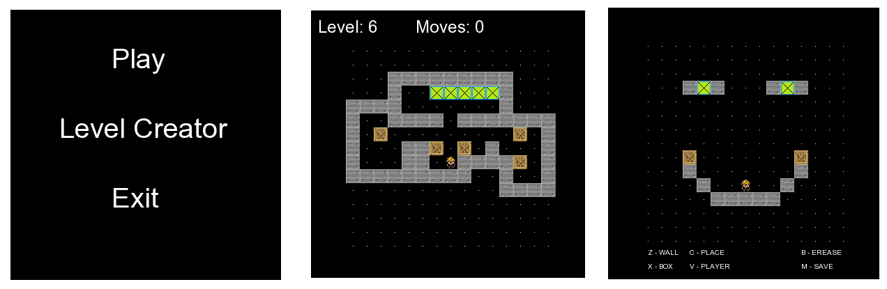

# Block Game - A Simple Puzzle Game

Block Game is a simple game made with C++ and SFML. This is a remake of an old game called sukoban, but in this version, you can create your own levels!

 

## Description

Block Game is a puzzle game where the player needs to push blocks onto designated spots. The player controls a character and must strategically move blocks to solve each level. The unique feature of this version is the ability to create custom levels, adding to the fun and challenge.

## Gameplay Overview

Controls
W, A, S, D: Move the character in the up, left, down, and right directions, respectively.
- **N**  Return to the main menu.

Controls in the level creator
- **Z**: Place a wall.
- **X**: Place a box (block).
- **C**: Place a target spot for a crate.
- **V**: Place the player character.
- **M**: Save map to file.
- **N**: Return to the main menu.
